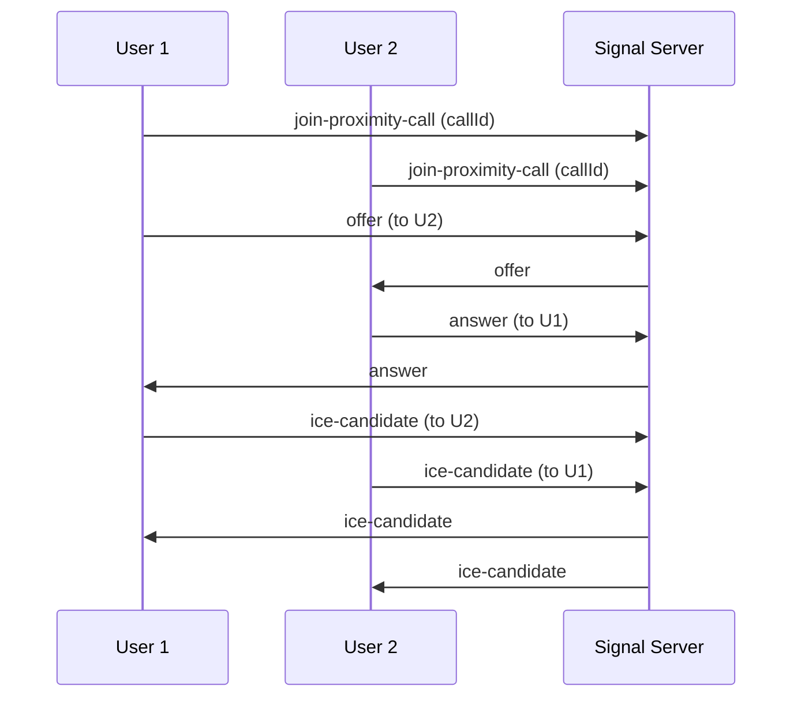
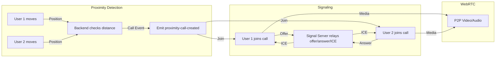

# Proximity-Based Video Calling in 2D Metaverse

## Table of Contents
1. [Overview](#overview)
2. [Glossary](#glossary)
3. [System Architecture](#1-system-architecture)
4. [Proximity Detection](#2-proximity-detection)
5. [User Journey: Step-by-Step](#user-journey-step-by-step)
6. [WebRTC Signaling Flow](#3-webrtc-signaling-flow)
7. [Code Modules & File Responsibilities](#code-modules--file-responsibilities)
8. [State Management & React Refs](#4-state-management--react-refs)
9. [Handling Race Conditions (ICE Candidate Queue)](#5-handling-race-conditions-ice-candidate-queue)
10. [Edge Cases & Error Handling](#edge-cases--error-handling)
11. [Security Considerations](#security-considerations)
12. [Debugging & Logging](#6-debugging--logging)
13. [Testing Strategies](#testing-strategies)
14. [User Experience](#7-user-experience)
15. [Future Improvements](#8-future-improvements)
16. [Summary Diagram](#9-summary-diagram)
17. [References](#references)
18. [Lessons Learned & Gotchas](#lessons-learned--gotchas)

---

## Overview
This document details the design and implementation of the proximity-based video calling system in the 2D metaverse project. It covers:
- System architecture
- WebRTC signaling flow
- Proximity detection
- State and ref management
- Race condition fixes
- Debugging and troubleshooting
- Security, testing, and lessons learned

---

## Glossary
- **WebRTC**: Web Real-Time Communication, a protocol for peer-to-peer audio, video, and data.
- **Signaling Server**: A server that relays signaling messages (offer/answer/ICE) between peers.
- **ICE Candidate**: Information about how to connect to a peer (IP, port, protocol).
- **SDP**: Session Description Protocol, describes media negotiation in WebRTC.
- **Peer Connection**: A direct connection between two browsers for media/data.
- **Proximity**: Users are considered in proximity if their avatars are within a certain distance in the virtual world.
- **Call Room**: A logical group of users in a call, identified by a `callId`.
- **Ref (React)**: A mutable object that persists across renders, used for immediate access to values.
- **State (React)**: Data that triggers UI updates when changed, but updates asynchronously.

---

## 1. System Architecture

```mermaid
graph TD
    A[User 1 (Browser)] -- WebSocket --> S(Signal Server)
    B[User 2 (Browser)] -- WebSocket --> S
    C[User 3 (Browser)] -- WebSocket --> S
    S -- WebSocket --> A
    S -- WebSocket --> B
    S -- WebSocket --> C
    A -- WebRTC (P2P) --> B
    B -- WebRTC (P2P) --> C
    C -- WebRTC (P2P) --> A
```

- **Signal Server**: Handles signaling (offer/answer/ICE) and call room management.
- **Clients**: Each user runs a browser client that manages their own WebRTC connections.

---

## 2. Proximity Detection

- Each user's position is tracked in real-time by the backend (via WebSocket messages).
- When two or more users are within a defined proximity radius, the backend emits a `proximity-call-created` event.
- The event includes a `callId` and a list of participant user IDs.
- All users in proximity join the same call room and begin WebRTC negotiation.
- When users move apart, the backend emits a teardown event and the call is closed.

---

## User Journey: Step-by-Step

1. **User Movement**
    - User moves their avatar in the 2D world.
    - Client sends position updates to the backend.
2. **Proximity Check**
    - Backend checks if users are within proximity.
    - If so, emits `proximity-call-created` with `callId` and participants.
3. **Call Join**
    - Each client receives the event and calls `joinProximityCall(callId, userId)`.
    - Client sets up local media (getUserMedia).
    - Client joins the call room via the signaling server.
4. **WebRTC Negotiation**
    - Each client creates a peer connection for every other participant.
    - Offers and answers are exchanged via the signaling server.
    - ICE candidates are exchanged and queued if needed.
    - When negotiation completes, media streams are attached to video elements.
5. **In-Call Experience**
    - Users see each other's video/audio in real-time.
    - UI updates as users join/leave the call.
6. **Call Teardown**
    - If users move apart, backend emits a teardown event.
    - Clients close peer connections, stop media, and update UI.

---

## 3. WebRTC Signaling Flow



- **Offer/Answer**: Standard WebRTC handshake.
- **ICE Candidates**: Exchanged for NAT traversal.

---

## 4. State Management & React Refs

### Why use refs?
- React state updates are asynchronous.
- WebRTC signaling requires immediate access to the current call ID.
- We use `useRef` for `currentCallIdRef` to ensure the value is always up-to-date in event handlers.

```typescript
const currentCallIdRef = useRef('');
setCurrentCallId(callId); // for UI
currentCallIdRef.current = callId; // for signaling
```

---

## 5. Handling Race Conditions (ICE Candidate Queue)

### Problem
- Sometimes ICE candidates arrive before the remote description is set, causing errors.

### Solution
- Queue ICE candidates until `setRemoteDescription` is called, then add them.

```typescript
const pendingCandidatesRef = useRef<Map<string, RTCIceCandidateInit[]>>(new Map());

// On ICE candidate received:
if (pc.remoteDescription && pc.remoteDescription.type) {
  pc.addIceCandidate(new RTCIceCandidate(candidate));
} else {
  // Queue
  if (!pendingCandidatesRef.current.has(fromUserId)) {
    pendingCandidatesRef.current.set(fromUserId, []);
  }
  pendingCandidatesRef.current.get(fromUserId)!.push(candidate);
}

// After setRemoteDescription:
const pending = pendingCandidatesRef.current.get(fromUserId) || [];
for (const candidate of pending) {
  await pc.addIceCandidate(new RTCIceCandidate(candidate));
}
pendingCandidatesRef.current.set(fromUserId, []);
```

---

## Edge Cases & Error Handling
- **ICE before remote description**: Candidates are queued and added after remote description is set.
- **User disconnects**: Signal server removes user from call and notifies others.
- **Call not found**: Server emits `call-not-found` and client shows error.
- **User not found**: Server emits `user-not-found` and client shows error.
- **Media device errors**: If `getUserMedia` fails, user is shown an error and call is not joined.
- **Multiple calls**: Only one call per user per space is allowed; joining a new call leaves the previous one.
- **Browser compatibility**: Uses standard WebRTC APIs, but some features may vary by browser.

---

## Security Considerations
- **Media permissions**: Users must grant camera/mic access; no media is sent without consent.
- **Signaling server**: Does not access media, only relays signaling data.
- **P2P encryption**: WebRTC encrypts all media/data by default (DTLS/SRTP).
- **Room access**: Only users in proximity can join a call room; backend enforces this.
- **No media storage**: No video/audio is recorded or stored.
- **Potential improvements**: Add TURN server for NAT traversal, authentication for signaling, and rate limiting.

---

## 6. Debugging & Logging

- **Debug logs** are added at every step:
    - When offers/answers/ICE are sent/received
    - When streams are attached
    - When errors occur
- **Example log output for a successful call:**
    ```
    [WebRTC] joinProximityCall called with: ...
    [WebRTC] Creating peer connection for remote user: ...
    [WebRTC] Creating offer for remote user: ...
    [WebRTC] Offer created successfully for ...
    [WebRTC] Local description set, sending offer to signal server
    [WebRTC] Received offer from ...
    [WebRTC] Creating answer for offer from ...
    [WebRTC] Answer created successfully for ...
    [WebRTC] Sending answer to ...
    [WebRTC] Answer sent successfully to ...
    [WebRTC] Received answer from ...
    [WebRTC] Successfully set remote description (answer) from ...
    [WebRTC] Received remote stream from ...
    [WebRTC] Remote stream tracks: ...
    [WebRTC] Video track 0 enabled: true ...
    ```
- **Example error log:**
    ```
    Error: [WebRTC] No current call ID when trying to send answer to ...
    InvalidStateError: Failed to execute 'addIceCandidate' on 'RTCPeerConnection': The remote description was null
    [WebRTC] No peer connection found for user ... to handle answer
    ```
- **Tips:**
    - Use browser dev tools to inspect WebRTC internals (chrome://webrtc-internals/)
    - Check signaling server logs for message flow
    - Use network tab to verify WebSocket messages

---

## Testing Strategies
- **Manual testing**: Open multiple browser windows, move avatars, verify video/audio.
- **Edge case testing**: Test rapid join/leave, disconnects, denied media permissions.
- **Automated tests**: (Future) Simulate users and automate movement/call events.
- **Cross-browser**: Test in Chrome, Firefox, Safari for compatibility.
- **Network conditions**: Test on different networks, with/without VPN, to verify ICE handling.

---

## 7. User Experience

- When users move close to each other, a video call is automatically established.
- Video and audio streams are exchanged peer-to-peer.
- UI updates in real-time to show all participants in the call.

---

## 8. Future Improvements

- Add mute/unmute and camera toggle controls
- Show call quality indicators
- Support for screen sharing
- Add text chat alongside video

---

## 9. Summary Diagram



---

## References
- [WebRTC Official Docs](https://developer.mozilla.org/en-US/docs/Web/API/WebRTC_API)
- [WebRTC Samples](https://webrtc.github.io/samples/)
- [MDN: Using WebRTC](https://developer.mozilla.org/en-US/docs/Web/API/WebRTC_API/Using_WebRTC)
- [Socket.IO Docs](https://socket.io/docs/)
- [React useRef](https://react.dev/reference/react/useRef)

---

## Lessons Learned & Gotchas
- **React state is asynchronous**: Use refs for immediate access in event handlers.
- **ICE candidate race**: Always queue candidates until remote description is set.
- **Debugging is critical**: Add logs everywhere, especially for signaling and media events.
- **Browser quirks**: WebRTC APIs are not always consistent; test on all target browsers.
- **Network issues**: Without a TURN server, some users may not connect (especially behind strict NATs).
- **User experience**: Handle denied permissions gracefully; always show clear errors.
- **Keep signaling simple**: Only relay what’s needed; avoid storing state on the server.

---

# End of Documentation 